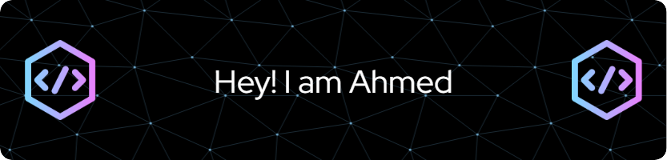

### Hi there 👋
I am Ahmed Jasarevic, Student at Tehnicka skola Zenica.

  

- 🌱 I’m currently learning **JQuery AJAX**

- 👨‍💻 All of my projects are available at [https://jasarevicahmed.pythonanywhere.com/](https://jasarevicahmed.pythonanywhere.com/)

- 📫 How to reach me **jasarevicahmed999@gmail.com**

<h3 align="left">Connect with me:</h3>

# 💻 Languages and Tools:
                       
# 📊 GitHub Stats:
 
 

